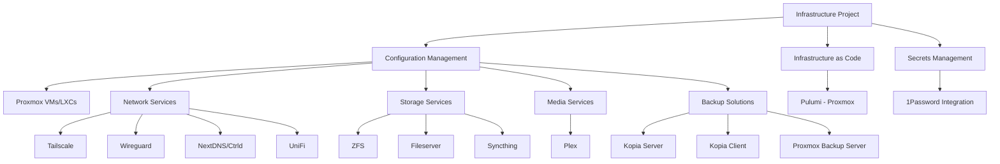

# Infrastructure Management

## Overview

This repository contains infrastructure management tools, including Ansible playbooks, roles, and configurations for managing a comprehensive home infrastructure environment. The project uses Ansible for configuration management and Pulumi for infrastructure as code, with integration to various services like Proxmox and 1Password for secrets management.

## Infrastructure Components

### Virtualization Platform

- **Proxmox**: The primary virtualization platform used for hosting VMs and LXCs. The Ansible configuration manages Proxmox nodes and their virtual machines through dynamic inventory.

### Network Services

- **Tailscale**: Secure mesh VPN for connecting all devices across the infrastructure. Managed through Ansible roles.
- **Wireguard**: Alternative VPN solution for secure networking.
- **NextDNS**: DNS filtering and security service.
- **Ctrld**: DNS-based security and filtering solution.
- **UniFi**: Network management for UniFi devices.

### Storage Solutions

- **ZFS**: Advanced filesystem with features like snapshots, data integrity verification, and RAID-like capabilities.
- **Fileserver**: NAS functionality for file sharing across the network.
- **Syncthing**: Continuous file synchronization between devices.

### Media Services

- **Plex**: Media server for streaming video content across devices.

### Backup Solutions

- **Kopia Server**: Backup server for managing backup repositories.
- **Kopia Client**: Client-side backup agent for systems requiring backups.
- **Proxmox Backup Server**: Dedicated backup solution for Proxmox VMs and containers.

### Container Management

- **Containers Role**: Manages Docker/Podman containers on hosts tagged with `service_compose`.

## Configuration Management

### Inventory Structure

The project uses dynamic inventory sources:

- **Proxmox Inventory**: Dynamically pulls hosts from Proxmox VE using the `community.general.proxmox` plugin.
- **1Password Integration**: Securely retrieves credentials for Proxmox and other services.

### Host Groups

Hosts are organized into functional groups based on their roles:

- `proxmox_nodes`: Physical Proxmox hypervisors
- `proxmox_all_qemu`: All QEMU VMs running on Proxmox
- `proxmox_all_lxc`: All LXC containers running on Proxmox
- `servers`: General purpose servers
- `service_*`: Hosts providing specific services (e.g., `service_files`, `service_plex`, `service_kopia`)

### Role Organization

Roles are structured to provide specific functionality:

#### Basic Infrastructure

- **basic**: Installs essential system packages (bash-completion, curl, dnsutils, fail2ban, git, htop, etc.) and configures vim as the default editor. Provides a consistent base environment across all managed systems.

- **containers**: Manages Docker/Podman containers on hosts tagged with `service_compose`. Sets up container runtime, networking, and configuration for containerized applications.

- **unattended_upgrades**: Configures automatic security updates for all systems, ensuring they remain patched against known vulnerabilities without manual intervention.

#### Network Services

- **tailscale**: Installs and configures Tailscale mesh VPN for secure networking between all infrastructure components. Sets up apt repositories, installs packages, configures network dispatcher scripts for UDP connectivity, and manages firewall rules for the Tailscale interface.

- **wireguard**: Deploys and configures WireGuard VPN as an alternative secure networking solution. Manages keys, peer configurations, and routing rules.

- **nextdns**: Implements NextDNS for DNS-based content filtering and security. Configures DNS resolution to use NextDNS servers with custom filtering profiles.

- **ctrld**: Sets up ctrld DNS security solution for additional DNS-based protection. Configures profiles and filtering rules for enhanced network security.

- **unifi**: Manages UniFi network controllers and devices. Handles installation, configuration, and maintenance of UniFi Controller software and integrates with the broader network infrastructure.

#### Storage Solutions

- **zfs**: Configures ZFS filesystem on storage servers. Manages ZFS pools, datasets, and encryption keys. Sets up system services for automatic key loading and includes node exporters for monitoring ZFS performance metrics.

- **fileserver**: Implements NAS functionality with Samba/NFS sharing. Configures storage exports, access controls, and user permissions for shared directories. Provides centralized file storage for the entire infrastructure.

- **syncthing**: Deploys Syncthing for continuous file synchronization between devices. Manages configuration, folders, and device pairing to ensure files remain synchronized across multiple endpoints.

#### Backup Solutions

- **kopia_server**: Deploys Kopia backup server for centralized backup management. Sets up the server with TLS certificates via Certbot, configures repository encryption, and establishes systemd services for maintenance, synchronization, and metrics export. Provides a web UI for backup management.

- **kopia_client**: Configures Kopia clients to back up to the Kopia server. Sets up backup schedules, retention policies, and source directories to ensure critical data is protected.

- **proxmox_backup_server**: Installs and configures Proxmox Backup Server (PBS) for VM and container backups. Manages storage pools, backup schedules, and retention policies specifically optimized for Proxmox virtualization environments.

#### Media Services

- **plex**: Deploys Plex Media Server for streaming media content. Configures NFS mounts for media libraries, sets up the Plex repository and service, and implements Caddy as a reverse proxy for secure remote access.

#### Security

- **1password**: Integrates 1Password for secure secrets management. Configures the 1Password CLI and agent for retrieving credentials used throughout the infrastructure.

## Infrastructure as Code

### Pulumi Integration

The [`pulumi/`](pulumi/) directory contains Pulumi code (Python) for managing infrastructure components that are better suited to IaC approaches:

- **Proxmox VM Provisioning**: Manages virtual machines across multiple Proxmox servers
- **Proxmox LXC Containers**: Provisions and configures LXC containers
- **Multi-Server Support**: Supports multiple independent Proxmox servers
- **Resource Import**: Facilitates importing existing VMs and containers into Pulumi management

See [`pulumi/README.md`](pulumi/README.md) for setup instructions and [`pulumi/PROXMOX_IMPORT_GUIDE.md`](pulumi/PROXMOX_IMPORT_GUIDE.md) for detailed instructions on importing existing Proxmox guests.

## Secret Management

Secrets are managed through 1Password integration:

- Credentials are retrieved at runtime using the `community.general.onepassword` lookup plugin
- No secrets are stored in the repository

## Development Environment

The project includes several development tools:

- **Devbox**: For consistent development environments
- **Pre-commit hooks**: For code quality checks
- **Ansible-lint**: For Ansible best practices enforcement
- **Vendir**: For vendoring external dependencies
